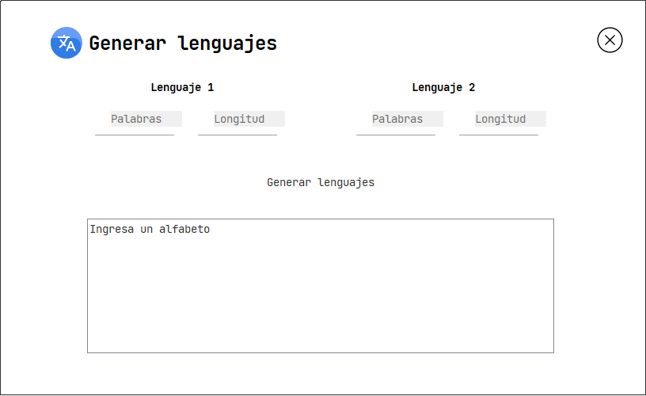
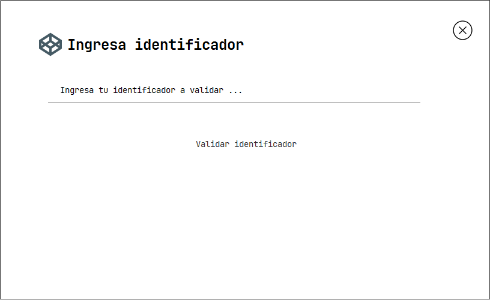

# Alphabet 

### String and language parser of an alphabet with regular expressions

  
The program is a parser of words of an alphabet with regular expressions, it takes as input the symbols of the alphabet, which can be entered by enumeration (a, b, c, d, ...) or by range (A-Z):
  

  
Also, it compares two strings and describes whether one is a suffix, prefix, substring, or subsequence of the other.
  

  
Likewise, it generates languages ​​based on the alphabet provided according to the number of elements and their length.
  

  
Finally, by using regular expressions it validates if a string is a valid identifier in the Java programming language
  

